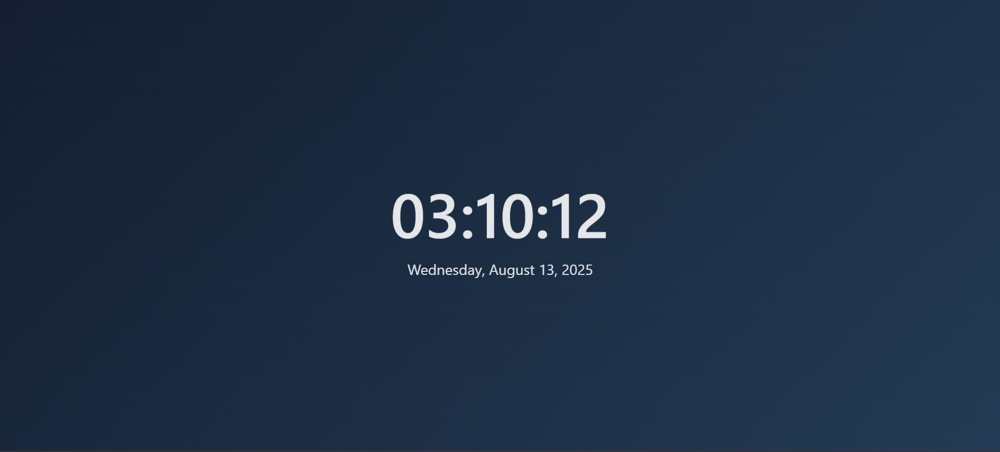

# Adaptive Digital Clock with Cloudy-Luminous Background

A modern and minimal digital clock featuring:
- **Adaptive Theme**: Background colors change based on the time of day (Morning, Noon, Night).
- **Smooth cloudy-luminous gradient** with no visible borders.
- **Soft fade effect** when numbers update.
- Minimalist, center-aligned design.

## Preview
   

## How to Use
1. Clone or download the project:
```bash
git clone https://github.com/USERNAME/adaptive-digital-clock.git
